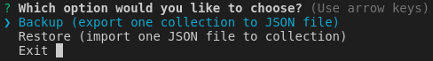

# backup-firestore
Backup and restore Firestore collections.

## General info
You cannot use $ gcloud firestore import/export in Firebase Spark plan, only Blaze plans.  
This project allow you:  
* Backup Firestore collection to JSON file.  
* Restore Firestore collection from JSON file.   

## Setup
To run this project, install it locally using npm:

```
$ npm install
$ npm start
```


